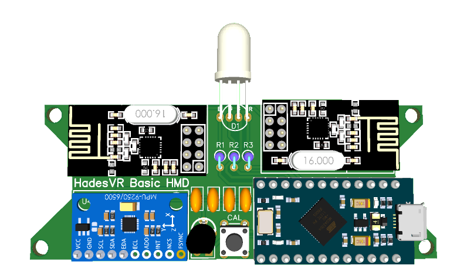
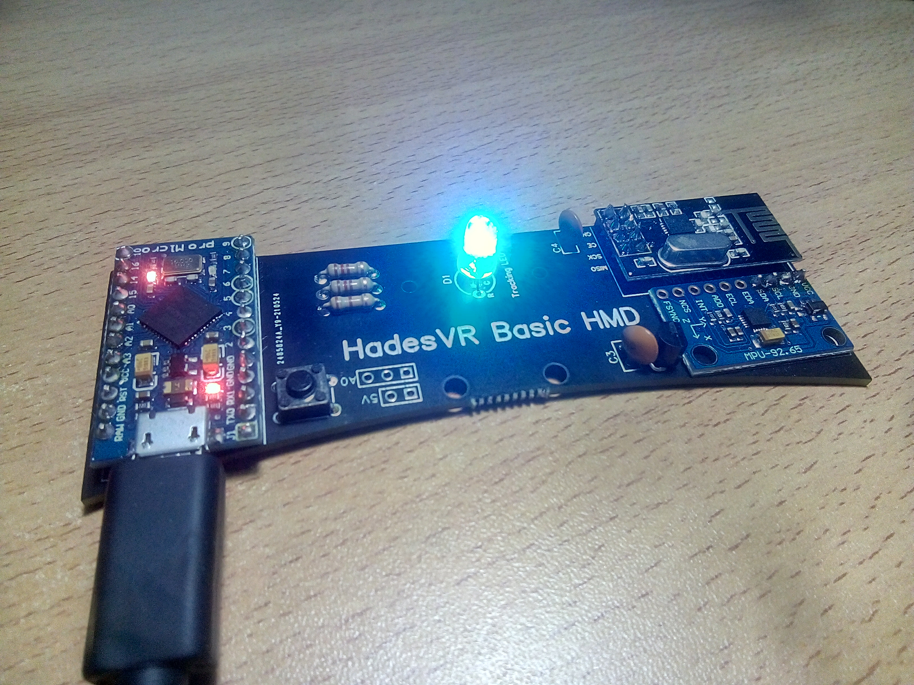
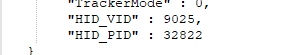

# HadesVR Basic HMD 

The HadesVR Basic HMD is a PCB that helps you convert any "Phone VR" headset into a PC VR headset. It's included with the [Wand controller pcbs](TODO:ADD_LINK) as a kit to get you started or you can have it made on its own with the included gerber files.

The PCB addds support for all the electronics required to connect to a PC, get rotation data from the headset and get controller and tracker data wirelessly in a 100x35mm board with no SMD components.

It uses an Arduino Pro Micro as it's core, an MPU9250 as IMU (though it can be replaced by something like a BNO085 for better results if you're feeling like modifying the code a little), and an NRF24L01 to receive data from controllers and trackers. It also has hardware support for an RGB LED to use with a ping pong ball for 6dof tracking using PSMoveService.

## Hardware Needed

| Component | Purpose | Notes | Amount |
| --------- | ----------- | ----- | ------ |
| Arduino Pro Micro | Used to interface with PC through HID | **Not** an Arduino nano or a pro mini, those can't do USB HID. | 1 |
| MPU9250*   | Used to gather rotation data from the headset | The IMU should sit flat against the pcb, this means you'll need to remove the black spacers on the pin headers after soldering them to the IMU. | 1 | 
| NRF24L01  | Used to receive wireless data from controllers / trackers | - | 1 | 
| HT7533 voltage regulator | Used to regulate voltage for the IMU and RF receiver | HT7333 or MCP1700-3302E are also compatible. | 1 |
| 100nF capacitor | Used to smooth out the input and output regulator voltage. | - | 2 | 
| 5mm RGB LED | Used for 6dof tracking | Common anode or common cathode are both supported. | 1 |
| 6x6 tact switch| Used to enter magnetic calibration mode | - | 1 |
| 120Ω Resistor | Used to limit the current for the green and blue colors of the LED | 1/4w | 2 |
| 180Ω Resistor | Used to limit the current for the Red color of the LED | 1/4w | 1 |
| White ping pong ball | Used to difuse the LED's light for 6dof tracking | Any will do as long as it's white and 40mm in diameter | 1 |
| 3D printable cup | Holds the tracking ball against the LED and makes it so the light is diffused evenly. | ~~3D printable file not yet ready, sorry!~~ | 1 | 

*Any 3.3v IMU with that same pinout will work if you modify the code to allow for it: A very good replacement for the MPU9250 is the BNO085 which is actually meant to be used for vr applications so it has some built in stabilization.

## Building the board

The board only has a few components, they all go on the top layer and can be soldered in any order though you might find it easier to leave the calibration tact switch for last.

The IMU should be mounted as flat against the board as possible to minimize an offset angle, to do this you will have to remove the black plastic separator from the pin headers:

* Put your IMU an it's pin headers on a breadboard and make sure it's straight
* Solder the pin headers to the IMU
* **Carefully** remove the black plastic bit on the pins under the IMU with a box cutter or an exacto knife
* Solder it to the HMD PCB.

The end result should look something like this:

## Uploading the firmware and calibrating the magnetometer.

To upload the firmware you will need to have the [RF24 Arduino Library](https://github.com/nRF24/RF24) installed in your [Arduino IDE](https://www.arduino.cc/en/software). 

You can download the required library using the Libraries manager from within the Arduino IDE. The rest of the used libaries are already included in the firmware folder.

* Open "Firmware.ino" in the firmware folder with the arduino IDE.
* If your LED is Common anode you'll need to comment out the line `#define COMMON_CATHODE`
* Select "Arduino Leonardo" in the boards menu.
* plug in your HMD board and select the COM port your Arduino Pro Micro is in (might come up as Arduino Leonardo).
* Click upload and wait for the upload to be done.

If all goes well the tracking LED should be flashing RED once every second, meaning the magnetometer hasn't been calibrated.

To calibrate the magnetometer you can simply press the calibration button on the board until the tracking LED turns blue, once it does you'll need to wave the board in a figure 8 pattern at a medium speed until the tracking LED turns green.

Once the tracking LED has turned green you should unplug the board and plug it back in to reset it, if all goes well you should have a solid color LED as your tracking LED.

If you ever need to recalibrate your magnetometer you can do so by holding the calibration button with the board off and then plugging in the board. This will put it into magnetic calibration mode.

After calibrating the magnetometer you can press the button to change the tracking color it's recomended you either use green blue or red.

## Getting HID values

To configure the driver you will need the VID and PID values from the board you're using. The easiest way of getting them is going to the Arduino IDE, clicking on tools and clicking on get board info with the HMD plugged in:

Do note these values are in HEX so to use them in the driver config file you'll need to convert them to decimal numbers.
to do that you can use websites like [Rapidtables](https://www.rapidtables.com/convert/number/hex-to-decimal.html), just input your VID and PID values one at a time and convert them to decimal numbers.

Once done, you'll get values like these and then all you have to do is load them up in your driver config file. For more details on driver configuration, check out the driver configuration docs over at the main repo.

## Error codes
If something's wrong with your board the tracking LED will flash different colors a certain number of times:

| LED pulses | Description |
| ------------- | ----------- |
| 1 short RED | Magnetic calibration values have not been set! you need to run the magnetic calibration before using this board! |
| 2 short RED| IMU configuration error / IMU not detected. |
| 3 short RED| Magnetometer configuration error / Magnetometer not detected. |
| 1 short GREEN | New magnetic calibration data set, board restart required. |