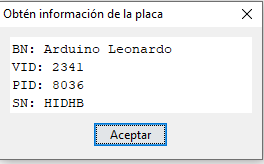

# HadesVR Basic HMD 

The HadesVR Basic HMD is a PCB that helps you convert any "Phone VR" headset into a PC VR headset. It's intended to be used with the [Wand controller pcbs](https://github.com/HadesVR/Wand-Controller) as a kit to get you started, however it can be used standalone or with other DIY controllers.

The PCB addds support for all the electronics required to connect to a PC, get rotation data from the headset and get controller and tracker data wirelessly in a 100x35mm board with no SMD components.

Revision 2 of the board comes with a few improvements, namely more filtering for the 3,3v rail, support for 3.3v only IMU's, optional dual RF modules for better RF performance and better mounting holes. All while keeping the board simple and easy to build by a beginner.

The new Revision 2 firmware also adds support for easy Serial calibration, just plug in your board, open the serial monitor and follow the steps on the screen to calibrate. This new firmware can detect if the board is a Rev 1 board or if it's a Rev 2 board and configure itself accordingly, meaning it's fully backwards compatible with Rev 1 boards.

The Basic HMD PCB uses an Arduino Pro Micro as it's core, an MPU9250 as IMU (though it can be replaced by something like a BNO085 for better results if you're feeling like modifying the code a little), and an NRF24L01 to receive data from controllers and trackers. It also has hardware support for an RGB LED to use with a ping pong ball for 6dof tracking using PSMoveService.

Do note that any IMU supported by the [FastIMU](https://github.com/LiquidCGS/FastIMU) library is supported, however it is strongly recommended that an IMU with a built in magnetometer is used for the best experience. 

## Hardware Needed

| Component | Purpose | Notes | Amount |
| --------- | ----------- | ----- | ------ |
| Arduino Pro Micro* | Used to interface with PC through HID | **Not** an Arduino nano or a pro mini, those can't do USB HID. | 1 |
| IMU**   | Used to gather rotation data from the headset | The IMU should sit flat against the pcb, this means you'll need to remove the black spacers on the pin headers after soldering them to the IMU. | 1 | 
| NRF24L01***  | Used to receive wireless data from controllers / trackers | - | 1/2 | 
| HT7533 voltage regulator | Used to regulate voltage for the IMU and RF receiver | HT7333 or MCP1700-3302E are also compatible. The board is designed for the TO-92 package of both of them. | 1 |
| 470nF capacitor | Used to smooth out the input and output regulator voltage. | - | 4 | 
| 5mm RGB LED | Used for 6dof tracking | Common anode or common cathode are both supported. | 1 |
| 6x6 tact switch| Used to enter magnetic calibration mode | - | 1 |
| 120Ω Resistor | Used to limit the current for the green and blue colors of the LED | 1/4w | 2 |
| 180Ω Resistor | Used to limit the current for the Red color of the LED | 1/4w | 1 |
| White ping pong ball | Used to difuse the LED's light for 6dof tracking | Any will do as long as it's white and 40mm in diameter | 1 |
| 3D printable cup | Holds the tracking ball against the LED and makes it so the light is diffused evenly. | ~~3D printable file not yet ready, sorry!~~ | 1 | 

*⚠️ Not an Arduino Micro either, not only will it not fit, it has a completly different pinout!!!! you need an **Arduino Pro Micro** for this build.

**Any 3.3v IMU with that same pinout will work as long as it's supported by the [FastIMU](https://github.com/LiquidCGS/FastIMU) library, which was made mainly for HadesVR.

***Dual NRF24L01's are recommended, each one in charge of receiving the data for one controller, that way latency is kept to a minimum, however the board *can with a single one* if the secondary NRF24L01 is not found on startup.

## Building the board

### ⚠️If you've got a Rev 2.1 board, you need to solder the voltage regulator in the *opposite direction* to what is on the silkscreen, this is due to an error with the footprint in that specific hardware version. Rev 2.2 boards fix this mistake.

The board only has a few components, they all go on the top layer and can be soldered in any order though you might find it easier to leave the calibration tact switch for last.

The IMU should be mounted as flat against the board as possible to minimize an offset angle, to do this you will have to remove the black plastic separator from the pin headers:

* Put your IMU and it's pin headers on a breadboard and make sure it's straight
* Solder the pin headers to the IMU
* **Carefully** remove the black plastic bit on the pins under the IMU with a box cutter or an exacto knife
* Solder it to the HMD PCB.

The end result should look something like this:

## Uploading the firmware and calibrating the sensors

To upload the firmware you will need to have the [RF24 Arduino Library](https://github.com/nRF24/RF24) installed in your [Arduino IDE](https://www.arduino.cc/en/software).
You will also need the [FastIMU](https://github.com/LiquidCGS/FastIMU) library installed.

You can download both required libraries using the Library manager from within the Arduino IDE. 

* Open "Firmware.ino" which is situated inside the Calibration folder inside the firmware folder with the arduino IDE.
* Set up your IMU address and IMU type. if you're unsure of the address or type you can use the IMUIdentifier example sketch provided with the FastIMU library.
* if your LED is Common cathode you'll need to uncomment `#define COMMON_CATHODE` for it to work, if it's Common anode you won't need to change anything.
* Set up your IMU geometry if it's different than the default 
* If you're gonna calibrate the board for the first time I recommend calibrating it "flat", so leave `#define CALIBRATE_FLAT` uncommented. This means the bottom of the board must be flat and paralell against the ground when calibrating. if your board is mounted vertically to a headset you should comment this line.
* Select "Arduino Leonardo" in the boards menu.
* Plug in your HMD board and select the COM port your Arduino Pro Micro is in (might come up as Arduino Leonardo).
* Click upload and wait for the upload to be done.
* LED should light up White and stay blinking. This means there is no calibration data stored on the EEPROM.
* Open the serial monitor and follow the steps to calibrate the accelerometer/gyro and magnetometer if you have one.
* Once done, the LED will turn blue, this is your prompt to close the serial monitor as the IMU calibration has finished, the values will be saved to EEPROM.  If you need to recalibrate the board, simply restart the board and open the serial monitor again.

If your view is crooked or too drifty you might need to calibrate your magnetometer, accelerometer and gyroscope again, to do that simply open the Serial monitor and follow the instructions!

Once you have the firmware.ino sketch uploaded to the board and you've done all calibration procedures you can press the button to change the tracking color of the ball. I recomended you either use green blue or red.

## Getting HID values

To configure the driver you will need the VID and PID values from the board you're using. The easiest way of getting them is going to the Arduino IDE, clicking on tools and clicking on get board info with the HMD plugged in:

Do note these values are in HEX so to use them in the driver config file you'll need to convert them to decimal numbers.
to do that you can use websites like [Rapidtables](https://www.rapidtables.com/convert/number/hex-to-decimal.html), just input your VID and PID values one at a time and convert them to decimal numbers.

#### IMPORTANT NOTE: If you're using arduino IDE 2.0.x, there's a bug that makes it so that some arduino boards display the wrong PID value, try the default one set with the driver first and if that doesn't work you'll have to check them from device manager.

Once done, you'll get values like these and then all you have to do is load them up in your driver config file. For more details on driver configuration, check out the driver configuration docs over at the main repo.

## Color codes
If something's wrong with your board the tracking LED will turn a few different colors. You can uncomment `#define SERIAL_DEBUG` to see the startup process in more detail:

| LED pulses | Description |
| ------------- | ----------- |
| Blinking YELLOW | Error connecting to the Main NRF module. |
| Blinking RED | Error initializing IMU |
| Blinking WHITE | Calibration data is invalid, must redo calibration |